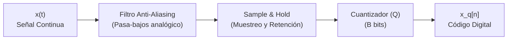

# Apuntes de Clase 1 - Procesamiento Digital de Señales (APS)
**Fecha:** Inicio de Cursada  
**Profesor:** Mariano Llamedo  
**Material de origen:** Transcripción de audios + Apuntes de laboratorio (Páginas 1 a 5)

---

# Página 1: Introducción al PDS, Señales Continuas y Muestreo Discreto

### 1. Definición del Procesamiento Digital de Señales (PDS / APS)
El Procesamiento Digital de Señales consiste en manipular, analizar y filtrar señales de la física real (audio, ECG, EEG, imágenes, radar) mediante computadoras o procesadores digitales (DSP, FPGA, microcontroladores).

#### Ventajas del Procesamiento Digital frente al Analógico:
* **Inmunidad a derivas térmicas y envejecimiento:** Los componentes analógicos (resistencias, capacitores) varían con la temperatura; los algoritmos en código entregan siempre el mismo resultado.
* **Flexibilidad y reprogramabilidad:** Cambiar la frecuencia de corte de un filtro digital requiere modificar una línea de código en lugar de soldar nuevos componentes.
* **Procesamiento complejo:** Algoritmos avanzados (FFT, compresión MP3/JPEG, filtros adaptativos) son imposibles de implementar con circuitos analógicos puros.

---

### 2. Clasificación Fundamental de Señales
* **Señal continua / analógica $x(t)$:** Definida para todo instante de tiempo continuo $t \in \mathbb{R}$. La amplitud y el tiempo son continuos.
* **Señal discreta $x[n]$:** Secuencia ordenada de números reales o complejos definida únicamente para valores enteros del índice $n \in \mathbb{Z}$.
* **Señal digital:** Discreta tanto en tiempo (muestreada) como en amplitud (cuantizada en $B$ bits).

---

### 3. El Proceso de Muestreo Uniforme (Sampling)
Para pasar del mundo continuo al discreto, tomamos lecturas instantáneas de la señal continua $x(t)$ cada intervalo de tiempo fijo $T_s$:

$$x[n] = x(n \cdot T_s) = x\left(\frac{n}{f_s}\right)$$

* **$T_s$ (Período de Muestreo):** Tiempo en segundos entre dos muestras consecutivas.
* **$f_s = \frac{1}{T_s}$ (Frecuencia de Muestreo):** Cantidad de muestras tomadas por segundo ($\text{Hz}$ o $\text{muestras/s}$).

---

# Página 2: Conversión Analógico-Digital (ADC) y Circuitería de Muestreo

### 1. Diagrama de Bloques de la Conversión A/D
El paso del mundo físico al digital requiere tres etapas encadenadas:



1. **Filtro Anti-Aliasing:** Filtro pasa-bajos analógico que limita el ancho de banda a $f_{\max} \le f_s/2$.
2. **Muestreador y Retenedor (Sample and Hold - S&H):** Mantiene la tensión constante durante $T_s$ segundos.
3. **Cuantizador:** Asigna a la tensión retenida el código binario más cercano entre $2^B$ niveles discretos.

---

### 2. Muestreo Ideal vs. Muestreo Real
* **Muestreo Ideal (Teórico):** Multiplicar la señal continua $x(t)$ por un tren de impulsos de Dirac ideales $p(t) = \sum \delta(t - n T_s)$.
  * *Imposibilidad física:* La delta de Dirac requeriría una amplitud infinita y energía infinita en un tiempo cero.
* **Muestreo Real (Hardware ZOH):** El circuito de retención de orden cero (Zero-Order Hold - ZOH) sostiene la tensión constante en el intervalo $T_s$, entregando un tren de pulsos rectangulares de ancho finito.

---

# Página 3: Teorema de Muestreo de Nyquist-Shannon y Aliasing

### 1. Enunciado del Teorema de Nyquist-Shannon
Para poder reconstruir **exactamente e idénticamente** una señal continua $x(t)$ a partir de sus muestras discretas $x[n]$, la frecuencia de muestreo $f_s$ debe ser **estrictamente mayor o igual al doble de la máxima frecuencia espectral** $f_{\max}$ presente en la señal:

$$\boxed{f_s \ge 2 f_{\max}}$$

* **Frecuencia de Nyquist ($f_{\text{Nyq}}$):** $f_{\text{Nyq}} = \frac{f_s}{2}$. Es el límite físico superior de frecuencias que se pueden representar sin distorsión.

---

### 2. Fenómeno de Aliasing (Solapamiento Frecuencial)
Si se violan las condiciones de Nyquist ($f_s < 2 f_{\max}$):
1. Las réplicas periódicas del espectro en frecuencia se solapan entre sí.
2. Frecuencias altas de la señal se "disfrazan" (alias) de frecuencias bajas no existentes en la señal original.
3. El daño es **irreversible**: no existe ningún filtro digital posterior que pueda separar la señal del aliasing ya introducido.

---

# Página 4: Reconstrucción e Interpolación Ideal (Whittaker-Shannon)

### 1. La Fórmula de Interpolación por Sinc
En el dominio de la frecuencia, la reconstrucción ideal consiste en aplicar un filtro pasa-bajos rectangular de ancho $f_s$.  
En el dominio del tiempo, esto equivale a convolucionar las muestras discretas $x[n]$ con funciones **Sinc**:

$$\boxed{x(t) = \sum_{n=-\infty}^{\infty} x[n] \cdot \operatorname{sinc}\left( \frac{t - n T_s}{T_s} \right)}$$

donde $\operatorname{sinc}(u) = \frac{\sin(\pi u)}{\pi u}$.

> [!NOTE]
> **Propiedad de la Interpolación Ideal:**  
> En el instante exacto de muestreo $t = k T_s$, la función $\operatorname{sinc}(0) = 1$ mientras que todas las demás funciones Sinc desplazadas valen cero. Por lo tanto, la curva reconstruida pasa **exactamente** por los puntos muestreados.

---

# Página 5: Clasificación de Señales por Energía y Potencia + Código Python

### 1. Señales de Energía vs. Señales de Potencia

#### A) Señales de Energía ($E_x < \infty$)
Señales de duración finita o impulsivas. Su energía total es finita:
$$E_x = \sum_{n=-\infty}^{\infty} |x[n]|^2 < \infty \implies P_x = 0$$

#### B) Señales de Potencia ($P_x < \infty$)
Señales periódicas continuas e infinitas en el tiempo. Tienen energía infinita, pero su potencia media es finita:
$$P_x = \lim_{N \to \infty} \frac{1}{2N+1} \sum_{n=-N}^{N} |x[n]|^2 < \infty$$

---

### 2. Generación de Señales Básicas en Python (NumPy y Matplotlib)

En el laboratorio práctico, se implementa la generación de la senoidal limpia de 1 Watt:

```python
import numpy as np
import matplotlib.pyplot as plt

# Parámetros del experimento
fs = 1000.0   # Frecuencia de muestreo (1000 Hz)
N = 1000      # Cantidad de muestras
f0 = 1.0      # Frecuencia de la senoidal (1 Hz)

# Vector de tiempo discreto t = n / fs
n = np.arange(N)
tt = n / fs

# Senoidal pura de 1 Watt (Amplitud = sqrt(2))
A = np.sqrt(2)
xx = A * np.sin(2 * np.pi * f0 * tt)

# Graficar
plt.figure(figsize=(10, 4))
plt.plot(tt, xx, label='Senoidal Pura 1W (1 Hz)', color='tab:blue')
plt.title('Generación de Señal Discreta en Python')
plt.xlabel('Tiempo [segundos]')
plt.ylabel('Amplitud [Volts]')
plt.grid(True)
plt.legend()
plt.show()
```
