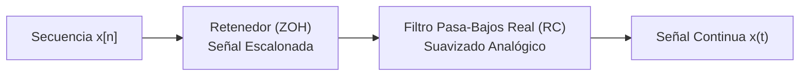

# Apuntes de Clase 4 - Procesamiento Digital de Señales (APS)
**Fecha:** 13/08  
**Profesor:** Mariano Llamedo  
**Material de origen:** Transcripción de audios (18.m4a, 19.m4a, UNSAM 22.m4a) + Apuntes manuscritos (Páginas 1 a 5)

---

# Página 1: Señales Elementales, Dominio Discreto y Muestreo Real

### 1. Señales Elementales para Compaginar Otras Señales
Para construir señales complejas (rampas, triangulares, pulsos), utilizamos bloques elementales:

#### A) Escalón Unitario $u(t)$
$$u(t) = \begin{cases} 0 & \text{si } t < 0 \\ 1 & \text{si } t \ge 0 \end{cases}$$
* **Propiedad de la derivada:** La derivada del escalón unitario es la Delta de Dirac: $\frac{d}{dt}u(t) = \delta(t)$.

#### B) Escalón Desplazado $u(t - t_0)$ y Pulso Rectangular $p(t)$
Un pulso rectangular de duración $t_0$ se define mediante la resta de dos escalones:
$$p(t) = \begin{cases} 0 & \text{si } t < 0 \\ 1 & \text{si } 0 \le t < t_0 \\ 0 & \text{si } t \ge t_0 \end{cases} \implies \boxed{p(t) = u(t) - u(t - t_0)}$$

* **Transformada de Fourier:** La transformada de un pulso rectangular en el tiempo es una función **Sinc** en la frecuencia.

---

### 2. Retomando la Clase 03: Dominio Doblemente Discreto
* Partimos de una señal continua $x(t)$ de energía finita con espectro en banda base acotado en $[-\omega_b/2, \omega_b/2]$.
* **Doble Discretización:**
  1. Discretizamos el **tiempo** con período $T_s = 1/f_s \implies$ El espectro se periodiza cada $f_s$.
  2. Discretizamos la **frecuencia** tomando $N$ muestras $\implies$ La secuencia en el tiempo se hace periódica de período $N$.
* **Banda Digital:** Intervalo espectral primario $[-f_s/2, +f_s/2]$. La frecuencia $f_s/2$ se conoce como la **Frecuencia de Nyquist**.
* **Resolución espectral:** Distancia entre dos puntos discretos adyacentes en frecuencia: $\Delta f = \frac{f_s}{N}$.

---

### 3. Muestreo Real en Hardware: ¿Cómo se toman las muestras?
* **Imposibilidad física:** En la práctica no podemos multiplicar por un tren de deltas ideales $\delta(t)$, ya que una delta requeriría energía infinita en tiempo cero.
* **Solución Electrónica:** Se utiliza un circuito de **Sample and Hold** (Muestreo y Retención):
  1. **Sample (Muestreo):** Se toma el valor instantáneo de la señal $x(t)$.
  2. **Hold (Retención):** Se mantiene (retiene) ese voltaje constante durante un intervalo $T_s$.
* Esto genera pulsos rectangulares angostos (aproximación de 1er orden o Retenedor de Orden Cero - ZOH). Esto le otorga el tiempo necesario al conversor electrónico para procesar la señal y convertirla a digital.

---

# Página 2: Reconstrucción Ideal (Sinc) vs. Reconstrucción Real (Filtros)

### 1. Reconstrucción Ideal en Frecuencia y Tiempo

#### A) En el Dominio de la Frecuencia (Filtrado Ideal)
Tenemos un espectro periódico discreto formado por infinitas réplicas espaciadas por $f_s$.
* Para recuperar la señal continua original, debemos eliminar todas las réplicas secundarias y quedarnos únicamente con la banda base $[-f_s/2, f_s/2]$.
* **Solución ideal:** Multiplicar en frecuencia por una **caja ideal (filtro pasa-bajos ideal)** de ancho $f_s$:
  $$H(\omega) = \begin{cases} 1 & \text{si } |\omega| \le \frac{\omega_s}{2} \\ 0 & \text{en otro caso} \end{cases}$$

#### B) En el Dominio del Tiempo (Interpolación por Sinc)
Multiplicar por una caja en frecuencia equivale a **convolucionar en el tiempo con una función Sinc**:
$$x(t) = x_d(t) * \operatorname{sinc}\left(\frac{\pi t}{T_s}\right) = \boxed{ \sum_{n=-\infty}^{\infty} x[n] \cdot \operatorname{sinc}\left( \frac{\pi (t - n T_s)}{T_s} \right) }$$

> [!NOTE]
> **Interpolación Ideal de Whittaker-Shannon:**
> En cada muestra $x[n]$ se ubica una función Sinc en el tiempo. Como la $\operatorname{sinc}(0) = 1$ y vale cero en todos los demás múltiplos enteros de $T_s$, al sumar todas las Sinc desplazadas se obtiene una curva continua que pasa **exactamente** por todas las muestras $x[n]$.

---

### 2. Dificultad Tecnológica: Reconstrucción en la Realidad
* **En la práctica NO existe la cajita ideal en frecuencia:** Un filtro con caída vertical infinita requeriría un sistema causal con respuesta al impulso infinita en el tiempo.
* **Tampoco tenemos deltas en el tiempo:** El hardware retenedor (ZOH) entrega una señal **escalonada** (tramos constantes de duración $T_s$).



---

# Página 3: Filtro Analógico de Reconstrucción y Proceso del ADC

### 1. El Filtro Pasa-Bajos Real (Circuito RC)
Para suavizar la señal escalonada que sale del retenedor, se la hace pasar por un filtro analógico real (como un filtro RC de 1er orden):

* **Sistema Lineal RC:**
  Respuesta al impulso: $h(t) = \frac{1}{RC} e^{-t/RC} u(t)$ (exponencial decreciente).
* **Interpolación Real:**
  Convolucionar los escalones con la exponencial decreciente une los puntos formando una curva suave que aproxima a la señal original.

> [!TIP]
> **Efecto de aumentar la frecuencia de muestreo ($f_s \gg 2 f_{max}$):**
> Si sobremuestreamos ($f_s$ muy alta), las muestras quedan tan juntas en el tiempo que las réplicas en frecuencia se alejan muchísimo. De este modo, **incluso un filtro analógico simple e imperfecto (como el filtro RC)** logra atenuar totalmente las réplicas lejanas y reconstruye la señal con alta fidelidad.

---

### 2. Proceso Interno del ADC: Muestreo + Cuantización
El Conversor Analógico-Digital (ADC) realiza **dos tipos de discretizaciones en simultáneo**:

```
Señal Continua x(t) ---> [ Filtro Anti-Aliasing ] ---> x'(t) ---> [ ADC (B bits) ] ---> Código Digital
                                                                   |
                                                      +-------------------------+
                                                      | 1. Discretiza Tiempo    | -> (t = n*Ts)
                                                      | 2. Discretiza Amplitud  | -> (B bits -> 2^B niveles)
                                                      +-------------------------+
```

#### Ejemplo con $B = 2$ bits ($2^2 = 4$ niveles posibles):
* Códigos binarios: `00`, `01`, `10`, `11`.
* Tensiones de referencia: $-V_{ref}$ a $+V_{ref}$ (Rango Completo $V_{FS} = 2 V_{ref}$).
* Si entra un valor analógico continuo como $x(t) = 1.673$ V, la circuitería interna debe compararlo con los niveles y tomar una decisión (asignarle el código `10` o `11`).

---

# Página 4: Señal de Error y Modelado Estadístico del Ruido

### 1. Definición del Error de Cuantización $e[n]$
Al discretizar la amplitud de la señal continua $x'(t)$, obtenemos una señal cuantizada $x_q[n]$.  
La diferencia entre la señal real y la cuantizada es la **señal de error**:
$$\boxed{e[n] = x'[n] - x_q[n]}$$

#### Paso de Cuantización ($q$):
Es la distancia física en Voltios entre dos niveles consecutivos de bits:
$$\boxed{q = \frac{V_{FS}}{2^B} = \frac{2 V_{ref}}{2^B}}$$

---

### 2. ¿Por qué el Ruido de Cuantización se modela como Variable Aleatoria?

Cuando digitalizamos, no podemos predecir el valor exacto de la señal en cada instante. Por lo tanto, el error $e[n]$ se comporta como una **señal estocástica (aleatoria)**.

#### A) ¿Normal (Gaussiana) o Uniforme (Caja)? ¿Por qué nos quedamos con la Uniforme?
En estadística existen dos distribuciones clásicas:
1. **Distribución Normal / Gaussiana ($\mathcal{N}$):** Tiene forma de campana y se extiende desde $-\infty$ hasta $+\infty$.
2. **Distribución Uniforme ($\mathcal{U}$):** Tiene forma de caja. Todos los valores dentro de un intervalo tienen la **misma probabilidad** de ocurrir, y fuera de ese intervalo la probabilidad es **cero**.

> [!IMPORTANT]
> **¿Por qué nos quedamos con la Distribución Uniforme $\mathcal{U}\left(-\frac{q}{2}, \frac{q}{2}\right)$?**  
> * **Cota estricta:** El error de cuantización $e[n]$ **nunca puede ser mayor que medio paso de cuantización** ($q/2$). Si fuera mayor a $q/2$, el conversor habría elegido el siguiente nivel de bit.
> * Como el error jamás puede ir a $\pm\infty$, la distribución Normal no sirve.
> * La distribución Uniforme refleja exactamente que el error está acotado estrictamente entre $-\frac{q}{2}$ y $+\frac{q}{2}$, y que cualquier valor dentro de esa franja es igualmente probable:
>   $$f_e(e) = \begin{cases} \frac{1}{q} & \text{si } -\frac{q}{2} \le e \le \frac{q}{2} \\ 0 & \text{en otro caso} \end{cases}$$

#### B) Incorrelación (Sin Correlación Lineal)
* El profesor destacó que el error $e[n]$ es **incorrelado** (sin correlación lineal).
* ¿Qué significa esto en la práctica? Que saber cuánto valía el error en la muestra anterior $e[n-1]$ **no te da ninguna información** para predecir cuánto valdrá el error en la siguiente muestra $e[n]$. No hay una relación determinística entre muestras consecutivas.

---

# Página 5: Estadísticos del Ruido, Estimadores y Medición de Calidad (SNR)

### 1. Fórmulas Estadísticas Clave del Ruido (Sin integrales)

#### A) Valor Medio / Esperanza Nula:
Si el redondeo es insesgado (al nivel más cercano), en promedio el error no va ni para arriba ni para abajo:
$$E[e] = 0$$

#### B) Varianza / Potencia del Ruido de Cuantización ($P_N$):
La potencia media del ruido de cuantización generada por el paso $q$ es:
$$\boxed{P_N = \operatorname{Var}(e) = \frac{q^2}{12}}$$

---

### 2. Estimadores Muestrales en la Práctica ($\hat{e}$ y $\hat{\sigma}^2$)
Cuando procesamos $N$ muestras reales de datos en una computadora (por ejemplo en Python/Numpy), no tenemos la función de probabilidad continua, sino un conjunto discreto de datos. Para calcular la media y varianza en la práctica usamos los **estimadores muestrales**:

* **Media Muestral ($\hat{e}$):** Promedio aritmético simple de las $N$ muestras de error:
  $$\hat{e} = \frac{1}{N} \sum_{n=0}^{N-1} e[n]$$
* **Varianza Muestral ($\hat{\sigma}^2$):** Promedio de las desviaciones al cuadrado (se divide por $N-1$ para obtener un estimador insesgado):
  $$\hat{\sigma}^2 = \frac{1}{N-1} \sum_{n=0}^{N-1} (e[n] - \hat{e})^2$$

*(En tus anotaciones figuraba la anotación del pizarrón de las dos sumatorias para calcular la media y la varianza a partir de muestras).*

---

### 3. Señales de Energía vs. Señales de Potencia
* **Señales Periódicas / Ruido de Cuantización $\to$ Señales de Potencia:**  
  Tienen energía infinita al extenderse en el tiempo, pero su **potencia media ($P_x$)** en un período es finita: $P_x = \frac{E_x}{N}$.
* **Señales Aperiódicas $\to$ Señales de Energía:**  
  Su energía total $E_x = \sum |x[n]|^2$ es finita (cuadrado sumables).

---

### 4. Medición de Calidad: Relación Señal a Ruido (SNR)

Para medir qué tan "limpia" o fiel es nuestra señal digitalizada respecto al ruido de cuantización introducido por el ADC, comparamos sus potencias:

$$\text{SNR} = \frac{P_x}{P_N} = \frac{\text{Potencia de la Señal}}{\text{Potencia del Ruido de Cuantización}}$$

En escala logarítmica (**Decibeles - dB**):
$$\boxed{\text{SNR}_{\text{dB}} = 10 \log_{10}\left( \frac{P_x}{P_N} \right)}$$

#### Relación Directa con la Cantidad de Bits ($B$):
1. **$\uparrow$ Bits ($B$):** Al usar más bits (ej. pasar de 8 a 16 bits), el intervalo completo $V_{FS}$ se divide en muchos más escalones ($2^B$).
2. **$\downarrow$ Paso de cuantización ($q$):** Los escalones $q = \frac{V_{FS}}{2^B}$ se hacen diminutos.
3. **$\downarrow$ Potencia de Ruido ($P_N = \frac{q^2}{12}$):** El ruido de cuantización cae drásticamente.
4. **$\uparrow$ Calidad (SNR):** La SNR sube aproximadamente **6 dB por cada bit** adicional que agregamos al conversor.

---

### 5. Experimentos de Laboratorio en Python en Detalle (Audio UNSAM 22.m4a)

En la segunda mitad de la clase práctica, el profesor Mariano guio la experimentación en Jupyter Notebook / Spyder usando la función de generación senoidal del TP0. A continuación se detallan minuciosamente cada uno de los **5 experimentos analizados**:

```python
# Parámetros base de simulación en Python:
fs = 1000.0  # Frecuencia de muestreo (1000 Hz => Ts = 1 ms)
N = 1000  # Cantidad de muestras (1 segundo total de observación)
```

---

#### 🧪 Experimento 1: Muestrear exactamente a la Frecuencia de Nyquist ($ff = 500$ Hz) y el Falso "Ruido" $10^{-12}$

* **Parámetros:** $f_s = 1000$ Hz, $ff = 500$ Hz (Frecuencia de Nyquist $f_{Nyq} = f_s/2 = 500$ Hz).
* **Análisis Teórico:**
  Muestreamos a $t = n \cdot T_s = n / 1000$ s. Para una senoidal sin desfasaje ($\phi = 0$):
  $$x[n] = \sin\left(2\pi \cdot 500 \cdot \frac{n}{1000}\right) = \sin(n \pi)$$
  Para $n = 0, 1, 2, 3, \dots \implies \sin(0)=0, \sin(\pi)=0, \sin(2\pi)=0 \dots$
  **Teóricamente todas las muestras deberían ser exactamente 0.**

* **¿Qué sucede al ejecutarlo en Python?**
  En el gráfico de Matplotlib la señal parece oscilar y en el eje Y aparece una etiqueta muy pequeña que dice `1e-12` (o `1e-16`).

* **Explicación del Profesor Mariano:**
  * **¡NO es un fallo del Teorema de Nyquist!**
  * Se debe al **error numérico acumulativo de representación en coma flotante (floating point)** de la computadora.
  * Al calcular `tt = np.arange(N) / fs`, la representación binaria del tiempo $t$ no da el cero matemático perfecto, sino una cantidad infinitesimal $\epsilon$.
  * Al hacer `np.sin(n * np.pi)`, la función no evalúa $0.000000000000$, sino un residuo de $10^{-12}$ V.
  * **Efecto de Matplotlib:** La librería Matplotlib hace un "auto-zoom" gigantesco de 12 órdenes de magnitud al eje Y. Como la señal oscila en $10^{-12}$, la escala automática la agranda y parece una onda enorme, pero en realidad es prácticamente **cero absoluto**.

---

#### 🧪 Experimento 2: Cambiar la Fase Inicial ($\phi = \pi/2$) en Frecuencia de Nyquist

* **Parámetros:** $f_s = 1000$ Hz, $ff = 500$ Hz, fase $\phi = \pi/2$ (coseno).
* **Análisis Teórico:**
  $$x[n] = \sin\left(n\pi + \frac{\pi}{2}\right) = \cos(n\pi) = [+1, -1, +1, -1, +1, -1, \dots]$$

* **Resultado:**
  * Al meter un desfasaje $\phi = \pi/2$, las muestras ya no caen en los cruces por cero.
  * Ahora caen justo en los **picos máximos positivos y negativos** ($+V_{MAX}$ y $-V_{MAX}$).
  * Tomamos exactamente **2 puntos por período**, que es la cantidad mínima requerida por Nyquist.

---

#### 🧪 Experimento 3: ¿Por qué la Interpolación Lineal de Matplotlib (`plt.plot`) falla con 2 puntos por período?

* **Observación en el gráfico de Python:**
  Al graficar los 2 puntos por período con `plt.plot(t, x)`, en la pantalla se ve una **onda triangular / serrucho** en lugar de una senoidal suave.

* **Explicación del Profesor Mariano:**
  * La función `plt.plot()` de Matplotlib es una herramienta visual estándar que realiza una **interpolación lineal** (une los puntos con líneas rectas).
  * **Cuando tenemos 10 o más puntos por período:** La interpolación lineal disimula bien y la curva parece una senoidal suave.
  * **Cuando solo tenemos 2 puntos por período:** Unir picos $+1$ y $-1$ con líneas rectas genera visualmente un triángulo/zig-zag.
  * **Aclaración conceptual:** Esto es un artefacto de la visualización de Python. El Teorema de Muestreo de Whittaker-Shannon garantiza que si usáramos la **interpolación ideal por Sinc** (DAC ideal), esos 2 puntos por período reconstruirían una **senoidal perfectamente suave**.

---

#### 🧪 Experimento 4: Aliasing fuera de la Banda Digital (Sintonizar $ff = 999$ Hz y $ff = 1001$ Hz)

La banda digital primaria con $f_s = 1000$ Hz es $[-500 \text{ Hz}, +500 \text{ Hz}]$. ¿Qué sucede si forzamos al generador a producir frecuencias por encima de Nyquist?

```
Banda Digital: [-500 Hz .................... 0 .................... +500 Hz]
                                                                        | (Nyquist)
                                                                        V
                                                            999 Hz  1000 Hz  1001 Hz
```

* **Caso A: Sintonizar $ff = 999$ Hz (1 Hz por debajo de $f_s$)**
  * La réplica del espectro entra a la banda digital en $f_{efectiva} = |1000 - 999| = 1$ Hz.
  * **Fenómeno:** Aparece una senoidal lenta de **1 Hz**, pero con **fase invertida ($\pi$ radianes / contrafase)** respecto a una de 1 Hz normal.

* **Caso B: Sintonizar $ff = 1001$ Hz (1 Hz por encima de $f_s$)**
  * La réplica entra a la banda digital en $f_{efectiva} = |1001 - 1000| = 1$ Hz.
  * **Fenómeno:** Aparece exactamente la misma senoidal de **1 Hz**, pero en **fase original ($0$ radianes)**.

* **Fórmula General del Aliasing:**
  Cualquier frecuencia $f$ fuera de la banda digital se repliega según:
  $$f_{\text{alias}} = |f - k \cdot f_s| \quad (k \in \mathbb{Z})$$
  * Si $f = k \cdot f_s - 1 \implies$ Se ve como $1$ Hz en **contrafase**.
  * Si $f = k \cdot f_s + 1 \implies$ Se ve como $1$ Hz en **fase original**.

> [!NOTE]
> **Analogía del Estroboscopio (Efecto Rueda de Carro / Hélice):**  
> El profesor Mariano explicó que este fenómeno es exactamente el mismo que ocurre en el cine o en videos cuando filmamos una rueda de auto o las palas de un helicóptero girando rápidamente. Debido a que la cámara toma cuadros a una frecuencia fija ($f_s$), cuando las palas giran casi a la misma velocidad de muestreo, la rueda parece **frenarse, girar lentamente hacia atrás (contrafase) o hacia adelante (en fase)**.

---

#### 🧪 Experimento 5: Comparación Técnica entre Filtro Anti-Aliasing y Filtro de Reconstrucción

En la discusión final del laboratorio, un estudiante preguntó si estos dos filtros eran el mismo circuito. El profesor Mariano aclaró:

| Característica | Filtro Anti-Aliasing | Filtro de Reconstrucción |
| :--- | :--- | :--- |
| **Ubicación en el sistema** | **Antes del ADC** (Mundo Analógico $\to$ Digital) | **Después del DAC** (Mundo Digital $\to$ Analógico) |
| **Tipo de circuito físico** | Filtro Pasa-Bajos Analógico ($f_c = f_s/2$) | Filtro Pasa-Bajos Analógico ($f_c = f_s/2$) |
| **Objetivo principal** | **Eliminar ruidos/frecuencias altas** $> f_s/2$ para evitar que se plieguen (aliasing) sobre la señal útil al muestrear. | **Eliminar las réplicas espectrales** ($f_s, 2f_s, \dots$) generadas por el retenedor ZOH para entregar una onda continua suave. |
| **Respuesta en frecuencia** | Idéntica (Ambos limitan energía por encima de Nyquist). | Idéntica (Ambos limitan energía por encima de Nyquist). |

> [!TIP]
> **En palabras sencillas:** Físicamente ambos son el mismo tipo de filtro pasa-bajos, pero los interpretamos de forma distinta según la tarea que cumplen: el **Anti-Aliasing limpia la entrada** antes de digitalizar, y el de **Reconstrucción limpia la salida** para volver al mundo analógico.
